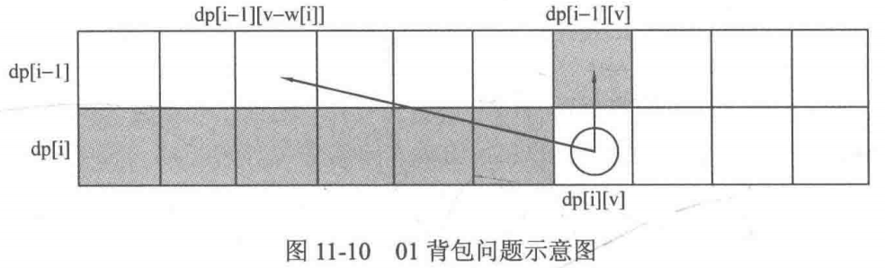

# 背包问题 -> leetcode下的背包问题
## 01背包问题
有n个物品, 重量分别为weight[i], 每个的价值是value[i]. 现有一个容量V的背包, 问如何选取物品放入背包, 可以让背包内物品的总价值最大
**其中每种物品都只有一件**

* 暴力解法: 每个物品都有两种选择: 放入或者不放入, 复杂度为O(2^n)

* dp: 复杂度O(nV)

### 二维

`dp[i][v]`: 前i件物品(1<=i<=n, 0<=v<=V)恰好装入容量为v的背包中所能获得的最大价值
考虑对第i件物品的选择策略, 有两种:

1. 不放入第i件物品, 那么问题转换为: 前i-1件物品恰好装入容量为v的背包中所能获得的最大价值, 也就是`dp[i][v] = dp[i-1][v]`

2. 放入第i件物品, 那么问题转换为: 前i-1件物品恰好装入容量为`v-weight[i]`的背包中所能获得的最大价值, `dp[i][v] = dp[i-1][v-weight[i]] + value[i]`


只有这两种策略, 取最大值即可, 状态转移方程如下

```
dp[i][v] = max(dp[i-1][v], dp[i-1][v-weight[i]] + value[i])
其中, 1<=i<=n, weight[i]<=v<=V
```


---

注意到`dp[i][v]`只与之前状态的`dp[i-1][]`有关, 所以可以枚举i从1至n, v从0到V, 通过边界`dp[0][v] = 0(0<=v<=V)`(即前0件物品放入任何容量v的背包中都只能获得价值0)就可以把整个dp数组递推出来. 

而由于`dp[i][v]`表示的是恰好为v的情况，所以需要枚举`dp[n][v](0<=v<=V)`,取其最大值才是最后的结果。

```
for (int i = 1; i <= n; i++) {
    for (int v = weight[i]; v <= V; v++) {
        dp[i][v] = Math.max(dp[i - 1][v], dp[i - 1][v - weight[i]] + value[i]);
    }
}
```

时间复杂度和空间复杂度都是O(nV), 其中空间复杂度可以再优化

有的时候, 会有另外一种写法:

上面虽然写的是`dp[i][v] = max(dp[i-1][v], dp[i-1][v-weight[i]] + value[i])`, 但是下面可以看到第i个数的下标是i-1, 

```java
// 遍历顺序：先遍历物品，再遍历背包容量
// 遍历物品, n为物品个数
for (int i = 1; i <= n; i++) {
    // 遍历背包容量
    for (int v = 1; v <= bagSize; v++) {
        // 其实就是当物品i的重量大于背包v的重量时,
        // 物品i无法放进背包中, 所以被背包内的价值依然和前面相同
        // 第i个数的下标是i-1
        if (weight[i - 1] > v) {
            dp[i][v] = dp[i - 1][v];
        } else {
            // 物品i可以放入背包,重量小于背包容量, 看要不要放入
            dp[i][v] = Math.max(dp[i - 1][v], dp[i - 1][v - weight[i - 1]] + value[i - 1]);
        }
    }
}
```

可以看到两者对背包容量的起始赋值不一致

### 一维 (滚动数组)



如图所示，注意到状态转移方程中计算`dp[i][v]`时总是只需要`dp[i-1][v]`左侧部分的数据(即只需要图中正上方与左上方的数据), 且当计算`dp[i+1][]`的部分时，`dp[i-1]`的数据又完全用不到了(只需要用到`dp[i][]`), 因此不妨可以直接开一个一维数组`dp[v]`(即把第一维省去), 枚举方向改变为i从1到n, v从V到0 ***(逆序!)***, 这样状态转移方程改变为:

```
dp[v] = max(dp[v], dp[v-weight[i]] + value[i])
其中, 1<=i<=n,weight[i]<=v<=V
```

这样修改对应到图中可以这样理解：v的枚举顺序变为从右往左，`dp[i][v]`右边的部分为刚计算过的需要保存给下一行使用的数据，而`dp[i][v]`左上角的阴影部分为当前需要使用的部分。将这两者结合一下，即把`dp[i][v]`左上角和右边的部分放在一个数组里，每计算出一个`dp[i][v]`，就相当于把`dp[i-1][v]`抹消，因为在后面的运算中`dp[i-1][v]`再也用不到了。我们把这种技巧称为**滚动数组**

```
```

### dp如何避免重复计算
在一开始暴力枚举每件物品放或者不放入背包时，其实忽略了一个特性：第i件物品放或者不放而产生的最大值是完全可以由前面i-1件物品的最大值来决定的，而暴力做法无视了这一点。
另外，01背包中的每个物品都可以看作一个阶段，这个阶段中的状态有`dp[i][0]`~
`dp[i][V]`，它们均由上一个阶段的状态得到。事实上，对能够划分阶段的问题来说，都可以尝试把阶段作为状态的一维，这可以使我们更方便地得到满足无后效性的状态。从中也可以得到这么一个技巧，如果当前设计的状态不满足无后效性，那么不妨把状态进行升维，即增加一维或若干维来表示相应的信息，这样可能就能满足无后效性了。


