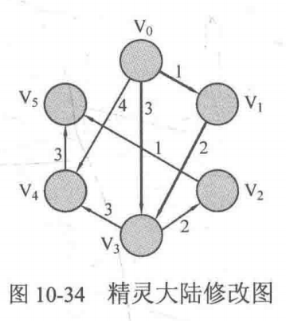

## 最短路径
对给出的图G(V,E)和起点S, 终点T, 求从S到T的最短路径  
常用的算法有: `Dijkstra`, `Bellman-Ford`, `SPFA`, `Floyd`

### Dijkstra: 无负权图的单源最短路径 -> ref: 算法笔记
#### 最短距离
* 基本思想  
对图G(V,E)设置集合S, 存放已被访问的定点, 然后每次从集合V-S中选择与起点s的最短距离最小的一个顶点(记为u), 访问并加入集合S. 之后, 令顶点u为中介点, 优化起点s与所有从u能到达的顶点v之间的最短距离. 这样的操作执行n次(n为顶点个数), 知道集合S已包含所有顶点  

* 注意点
    1. dijkstra只能应对所有边权非负数的情况, 如果边权出现负数, dijkstra可能出错, 这时候要用`SPFA算法`
    2. INF不能定义成`0x7fffffff`, 因为这样的两个数相加会超过int, 用`0x3fffffff`
    3. 邻接矩阵和邻接表两种图的表现方式不一样, 代码也不一样. `邻接矩阵`适用于顶点数不大的情况(<1000)

```
// 伪代码
// G为图, 一般设置成全局变量; 数组d为源点到各点的最短路径长度, s为起点
Dijkstra (G, d[], s) {
    初始化;
    for (循环n次) {
        u = 使d[u]最小的还未被访问的顶点的标号;
        记u被访问;
        for (从u出发能到达的所有顶点v) {
            if (v未被访问过 && 以u为中介点是s到v的距离比最短距离d[v]更优) {
                优化d[v];
            }
        }
    }
}
```
例子见: `AlexanderDemo.java`
推导的过程:

| currentNode(visited)| queue(从中取最小的)|
| ---- | ---- |
| null | s(0) |
| v0(0) | v1(1), v3(4), v4(4) |
| v1(1) | v3(3updated), v4(4) |
| v3(3) | v4(4), v2(5) |
| v4(4) | v2(5), v5(7) |
| v2(5) | v5(6updated) |
| v5(6) | null |

distance[]数组中就存储的是start结点到每一个结点的最短距离

#### 最短路径的求法
在伪代码中, 有这么一段:
```
if (v未被访问过 && 以u为中介点是s到v的距离比最短距离d[v]更优) {
                优化d[v];
}
```
这个地方的条件是: `以u为中介点可以使s到顶点v的最短距离d[v]更小`  
隐含了这么一层意思: 是d[v]变得更小的方案是让u作为s到v最短路径上v的前一个结点(s-> ... -> u -> v)  
所以, 我们将这个信息记录下来, 记录前驱结点`pre[]`, 令pre[v]表示从起点s到顶点v的最短路径上v的前一个顶点(即前驱结点)的编号, 这样子, 当伪代码条件成立的时候, 就可以把u赋给pre[v], 最终就可以把最短路径上每一个顶点的前驱结点记录下来.  
伪代码在*if*判断内添加一句:  
```
if (v未被访问过 && 以u为中介点是s到v的距离比最短距离d[v]更优) {
                优化d[v];
                令v的前驱为u
}
```
查看`AlexanderDemo.java`中的pre数据

如图这个简单的路径, 我们可以根据算法得到每个点的前驱
```
pre[4] = 3;
pre[3] = 2;
pre[2] = 1;
pre[1] = 1;
```
求v1到v4的路径, 那就是一个递归的逻辑, 从pre[4]知道前驱是3, 从pre[3]知道前驱是2, 从pre[2]中知道前驱是1, pre[1]是他本身, 递归结束  
所以递归代码:
```
// s为起点, v为当前访问的顶点编号(从终点开始递归)
void DFS(int s, int v) {
    // 当前到达起点s, 输出并返回
    if (v == s) {
        System.out.println(s);
        return;
    }
    // 递归访问v的前驱结点pre[v]
    DFS(s, pre[v]);
    // 最深层递归回来, 已经输出了起点, 接下来输出每一层的顶点v就可以了
    System.out.println(v);
}
```

***真正考试的时候不会这么"裸", 更多的是多条最短路径, 根据第二把标尺进行判断***
#### 最短路径考法
上面说的, 会有`第二把标尺`, 例如上面亚历山大的例子, 把v0->v3的距离改成3, 那么v0->v1->v3, v0->v3都是最短路径
  
**第一标尺: 距离**  
**第二标尺可能的出题类型:**
1. 给每个边再加上一个边权(比如说: 花费), 然后要求再最短路径有多条时, 要求路径上的花费之和最小(如果边权是其他含义, 也可以是最大)
2. 给每个点加上一个点权(例如: 每个城市能收集到的物资), 然后在最短路径有多条时, 要求路径上的点权之和最大(如果点权是其他含义的话也可以是最小)
3. 直接问有多少条最短路径  

对于这三种出题方法, 都只需要增加一个数组来存放新增的边权或点权或最短路径条数, 然后再Dijkstra算法中修改优化d[v]那个步骤即可, 其他步骤无需改动
>##### 1. 新增边权
以新增的边权代表花费为例, 用cost[u][v]表示u->v的花费(由题目输入).  
1. 新增一个数组c[], 令从起点s到达顶点u的最少花费为c[u], 初始化时只有c[s]为0, 其余c[u]都INF(类比亚历山大的初始图)  
2. 在d[u] + G[u][v] < d[v](即可以使s到v的最短距离d[v]更优)时更新d[v]和c[v]. 当d[u] + G[u][v] == d[v](即最短距离相同)且c[u]+cost[u][v]<c[v](即可以使s到v的最少花费更少)时更新c[v]
```
for (int v = 0; v < n; v++) {
    // 没有被访问过 && u能到达v
    if (!hasVisited[v] && G[u][v] != INF) {
        // 以u为中介点, 可以让d[v]更优
        if (distance[u] + G[u][v] < distance[v]) {
            distance[v] = distance[u] + G[u][v];
            c[v] = c[u] + cost[u][v];
        } else if (distance[u] + G[u][v] == distance[v] && c[u] + cost[u][v] < c[v]) {
            // 最短距离相同时, 看能否让花费更小, (c[v]更优)
            c[v] = c[u] + cost[u][v];
        }
    }
}
```

>##### 2. 新增点权
1. 以新增的点权代表城市中能收集到的物资为例, 用weight[u]表示城市u中物资的数目(题目输入), 并增加一个数组w[], 令从起点s到顶点u可以收集到的最大物资为w[u]. 初始化时w[s]为weight[s], 其他w[u]均为0.
2. 在d[u]+G[u][v] < d[v](即可以使s到v的最短距离d[v]更优)时更新d[v]和c[v]; 而当d[u]+G[u][v] == d[v](即最短距离相同)且w[u]+weight[v] > w[v](即可以使s到v的最大物资数目更优)时更新w[v]
```
for (int v = 0; v < n; v++) {
    // 没有被访问过 && u能到达v
    if (!hasVisited[v] && G[u][v] != INF) {
        // 以u为中介点, 可以让d[v]更优
        if (distance[u] + G[u][v] < distance[v]) {
            distance[v] = distance[u] + G[u][v];
            w[v] = w[u] + weight[v];
        } else if (distance[u] + G[u][v] == distance[v] && w[u] + weight[u][v] > w[v]) {
            // 最短距离相同时, 看能否让补充物资更多, (w[v]更优)
            w[v] = w[u] + weight[v];
        }
    }
}
```


>##### 3. 有多少条最短路径
1. 新增一个数组num[], 令从起点s到达顶点u的最短路径条数为num[u], 初始化时只有num[s] = 1, 其他num[u]均为0(由亚历山大例子初始图可推出)
2. 在d[u] + G[u][v] < d[v](即可以使s到v的最短距离d[v]更优)时更新d[v], 并让num[v]集成num[u]; 而当d[u] + G[u][v] == d[v](即最短距离相同)时将num[u]加到num[v]上
```
for (int v = 0; v < n; v++) {
    // 没有被访问过 && u能到达v
    if (!hasVisited[v] && G[u][v] != INF) {
        // 以u为中介点, 可以让d[v]更优
        if (distance[u] + G[u][v] < distance[v]) {
            distance[v] = distance[u] + G[u][v];
            num[v] = num[u];
        } else if (distance[u] + G[u][v] == distance[v]) {
            // 最短距离相同时, 累加num[u]
            // 这里只要相等就要累加 -> 注意Emergency_1003中的判断
            num[v] += num[u];
        }
    }
}
```

例题: `Emergency_1003`


