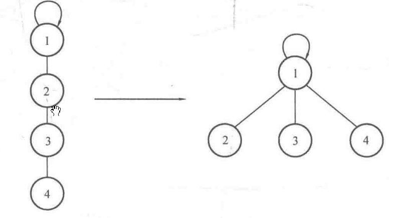

# 并查集
## 初始化, 查找, 合并

### 初始化

一开始，每个元素都是独立的一个集合，因此需要令所有`father[i]`等于i:

```c++
for(int i = 1; i <= N; i++) (
	father[i] = i;//令father[i]为-1也可,此处以father[i]=i为例
}
```


### 查找

1. 递推

由于规定同一个集合中只存在一个根结点，因此查找操作就是对给定的结点寻找其根结点的过程。

实现的方式可以是递推或是递归，但是其思路都是一样的，即反复寻找父亲结点，直到找到根结点（即``father[i]=i`的结点）。
递推的代码：

```c++
//findFather函数返回元素x所在集合的根结点
int findFather(int x) {
    while（x != father[x]）{//如果不是根结点，继续循环
        x = father[x]；//获得自己的父亲结点
    }
    return x;
}
```

2. 递归

```c++
int findFather(int x) {
    if(x==father[x]）return x；//如果找到根结点，则返回根结点编号x
    else return findFather(father[x]);//否则，递归判断x的父亲结点是否是根结点
}
```

### 合并

合并是指把两个集合合并成一个集合，题目中一般给出两个元素，要求把这两个元素所在的集合合并。

具体实现上一般是先判断两个元素是否属于同一个集合，只有当两个元素属于不同集合时才合并，而合并的过程一般是把**其中一个集合的根结点的父亲指向另一个集合的根结点。**

> 注意必须是两个根节点, 不能直接结点合并, 直接结点合并会覆盖原先的father, 导致断掉

于是思路就比较清晰了，主要分为以下两步：

1.对于给定的两个元素a、b，判断它们是否属于同一集合。可以调用上面的查找函数，对这两个元素a、b分别查找根结点，然后再判断其根结点是否相同。

2.合并两个集合：在①中已经获得了两个元素的根结点faA与faB，因此只需要把其中
一个的父亲结点指向另一个结点。例如可以令``father[faA]=faB`,当然反过来令``father[faB]=faA`也是可以的，两者没有区别。

```c++
void Union(int a, int b) {
	int faA = findFather(a)；//查找a的根结点，记为faA
	int faB = findFather(b)；//查找b的根结点，记为faE
	//如果不属于同一个集合
	if(faA !=faB) {
		father[faA]=faB;//合并它们
	}
}
```

## 并查集的性质

在合并的过程中，只对两个不同的集合进行合并，如果两个元素在相同的集合中，那么就不会对它们进行操作。这就保证了在同一个集合中一定不会产生环，即**并查集产生的每一个集合都是一棵树**


## 路径压缩

上面讲解的并查集查找函数是没有经过优化的，在极端情况下效率较低。

考虑一种情况，即题目给出的元素数量很多并且形成一条链，那么这个查找函数的效率就会非常低。

假设总共有10^5个元素形成一条链，那么假设要进行10^5次查询，且每次查询都查询最后面的结点的根结点，那么每次都要花费10^5的计算量查找，这显然无法承受。

需要对查询操作做优化

例子：

```
father[1]=1;
father[2]=1;
father[3]=2;
father[4]=3;
```


因此，如果只是为了查找根结点，那么完全可以想办法把操作等价地变成：

```
father[1]=1;
father[2]=1;
father[3]=1;
father[4]=1;
```

对应图形的变化过程如图所示：



这样相当于把当前查询结点的路径上的所有结点的父亲都指向根结点，查找的时候就不需要一直回溯去找父亲了，查询的复杂度可以降为O(1)

那么，如何实现这种转换呢? 回忆之前查找函数findFather的查找过程，可以知道是从给定结点不断获得其父亲结点而最终到达根结点的。

因此转换的过程可以概括为如下两个步骤：

1. 按原先的写法获得x的根结点r。
2. 重新从x开始走一遍寻找根结点的过程，把路径上经过的所有结点的父亲全部改为根结点r。


于是可以写出代码：

```c++
int findFather(int x) {
    //由于x在下面的while中会变成根结点，因此先把原先的x保存一下
    int a = x;
    while(x！=father[x]）{//寻找根结点
    x = father[x];
    }
    //到这里，x存放的是根结点。下面把路径上的所有结点的father都改成根结点
    while(a != father[a]){
    	int z = a;//因为a要被father[a]覆盖，所以先保存a的值，以修改father[a]
    	a=father[a]；//a回溯父亲节点
        father[z] = x;
    }
    return x;
}
```

这样就可以在查找时把寻找根结点的路径压缩了。

由于涉及一些复杂的数学推导，读者可以把路径压缩后的并查集查找函数均摊效率认为是一个几乎为O（1）的操作。

也可以采用下面的递归写法：

```C++
int findFather(int v) {
    //找到根结点
    if(v == father[v]) return v;
    else {
        //递归寻找father[v]的根结点F
        int F = findFather(father[v]);
        //将根结点F赋给father[v]
        father[v] = F;
        //返回根结点F
        return F;
	}
}
```


## 例题

`A1107`,